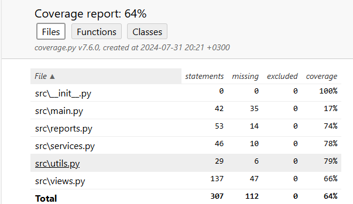

# Курсовая работа "Приложение для анализа банковских операций"
## Страница «Главная» 
#### Функционал принимает дату и выводит по каждой карте:
1. последние 4 цифры карты;
2. общая сумма расходов;
3. кешбэк (1 рубль на каждые 100 рублей). 
4. Затем выводится Топ-5 транзакций по сумме платежа.
5. Курс валют.
6. Стоимость акций из S&P500.
## Сервисы
Функция возвращает JSON со всеми транзакциями, содержащими в описании мобильные номера.
## Отчеты
#### Функция принимает на вход:
1. датафрейм с транзакциями,
2. название категории,
3. опциональную дату.
#### Функция возвращает траты по заданной категории за последние три месяца (от переданной даты).
### Написаны тесты для всех модулей
#### Для их запуска нужно прописать pytest
### Установите зависимости:
1. pip install -r requirements.txt 
2. pip install python-dotenv
### Использование:
1. Откройте проект.
2. Запустите файл main.py. в модуле src

# Покрытие тестами
